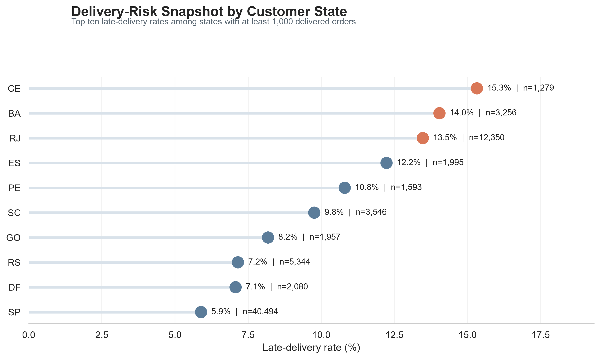
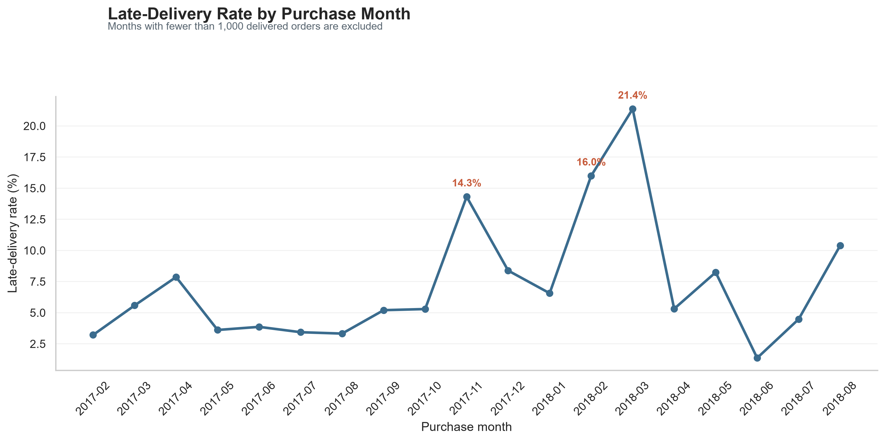
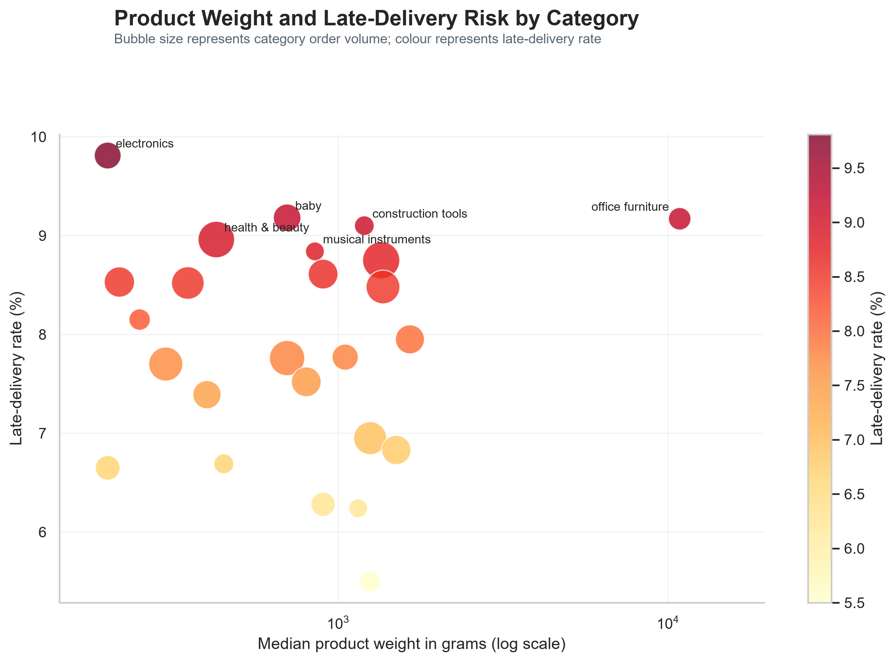

# E-commerce Delivery Reliability Analysis

A reproducible Python and SQL analysis of delivery reliability patterns in the
Olist Brazilian e-commerce dataset.

## Project question

Where and when are e-commerce delivery promises most likely to be missed, and
how do late-delivery patterns vary by customer location, order value, product
category, seller complexity, and purchase month?

## Why this project

Reliable delivery is important for customer experience and e-commerce
operations. This project examines historical delivered-order records to identify
descriptive patterns in late deliveries while carefully avoiding causal claims
that the data cannot support.

The analysis develops an end-to-end data-science workflow:

- auditing and cleaning multi-table data;
- handling one-to-many relationships safely;
- engineering delivery-time and late-delivery measures;
- analysing patterns with Pandas and DuckDB SQL;
- using CTEs and window functions;
- creating clear, reproducible visualisations;
- documenting limitations and interpretation.

## Dataset

- **Source:** [Olist Brazilian E-Commerce Public Dataset](https://www.kaggle.com/datasets/olistbr/brazilian-ecommerce)
- **Period represented:** 2016 to 2018
- **Raw files:** orders, order items, customers, sellers, products, payments,
  reviews, geolocation, and category translations
- **Primary unit of analysis:** Delivered orders with a recorded
  customer-delivery date
- **Orders analysed:** 96,470 delivered orders

Raw source CSV files are intentionally excluded from GitHub. See
[docs/data_source.md](docs/data_source.md) for source and handling details.

## Key findings

- **8.11%** of analysed delivered orders arrived after their estimated delivery
  date.
- Among states with at least 1,000 delivered orders, **CE** had the highest
  observed late-delivery rate at **15.32%**; **BA** and **RJ** followed at
  14.04% and 13.47%.
- Late-delivery rates increased from **7.18%** in the lowest order-value band
  to **8.97%** in the highest-value band.
- **Electronics** had the highest observed late-delivery rate among named
  product categories with at least 500 order-category combinations: **9.81%**.
- The highest observed late-delivery rate among purchase months with at least
  1,000 orders was **21.36% in March 2018**.

Read the full, carefully qualified interpretation in
[docs/key_findings.md](docs/key_findings.md).

## Visualisations

### Delivery-risk snapshot by customer state



### Late-delivery rate by purchase month



### Product weight and late-delivery risk



## SQL analysis

The project includes reproducible DuckDB SQL queries in
[sql/analysis_queries.sql](sql/analysis_queries.sql).

The SQL analysis demonstrates:

- conditional aggregation with `CASE WHEN`;
- common table expressions (CTEs);
- `GROUP BY` and `HAVING`;
- median calculations;
- `DENSE_RANK()` window functions.

## Repository structure

```text
├── data/
│   ├── processed/
│   │   └── delivery_orders_analysis.csv
│   └── raw/                         # Local source files; excluded from GitHub
├── docs/
│   ├── data_source.md
│   ├── key_findings.md
│   └── figures/
├── notebooks/
│   └── 01_data_inventory.ipynb
├── sql/
│   └── analysis_queries.sql
├── requirements.txt
└── README.md